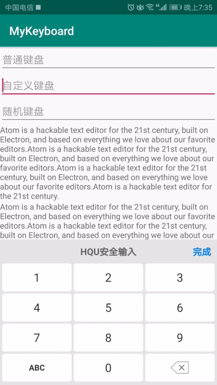

# Android自定义键盘，仿招商银行

### 功能：

- 支持数字、随机数字、字母、符号键盘
- 自定义键盘和系统键盘无卡顿切换
- 点击空白处隐藏键盘
- 空间不够，键盘自动上推

### 用法：

初始化

```java
    protected void initListener() {
        keyboardUtil = new KeyboardUtil(this, mMain_ll);//根布局 用来上推
        keyboardUtil.initKeyboard(MyKeyboardView.KEYBOARDTYPE_Num, mNum_ed);//数字键盘
        keyboardUtil.initKeyboard(MyKeyboardView.KEYBOARDTYPE_Pwd, mPwd1_ed, mPwd2_ed);//随机键盘
    }
```

关于键盘的类型

```java
    public static final int KEYBOARDTYPE_Num = 0;//数字键盘
    public static final int KEYBOARDTYPE_Pwd = 1;//数字键盘（密码）
    public static final int KEYBOARDTYPE_ABC = 2;//字母键盘
    public static final int KEYBOARDTYPE_Symbol = 4;//符号键盘
```


### 原理：

PopupWindow实现，轻量级解决方案

```java
mKeyboardView = (MyKeyboardView) mIncludeKeyboardview.findViewById(R.id.keyboard_view);
mWindow = new PopupWindow(mIncludeKeyboardview, ViewGroup.LayoutParams.MATCH_PARENT,
ViewGroup.LayoutParams.WRAP_CONTENT, false);
```

### 效果图如下:

<p align="center">


</p>


